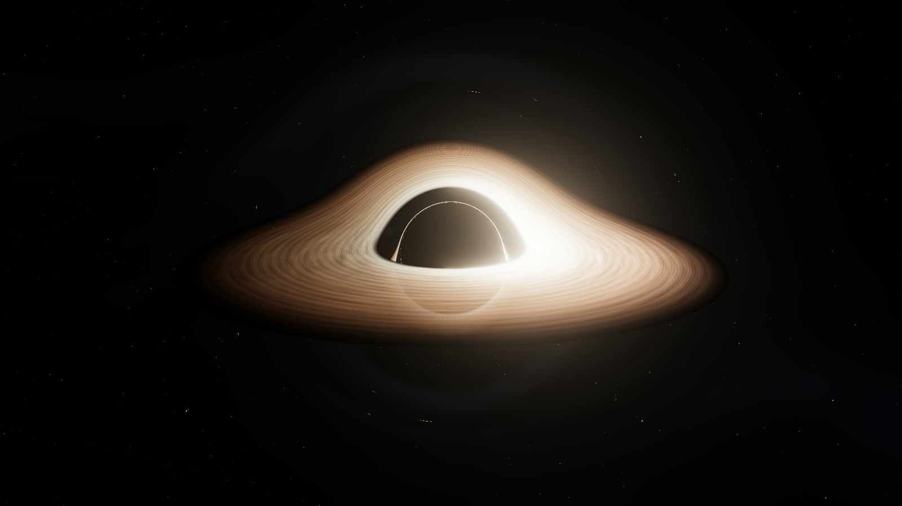

# TON 618 — Beyond the visible

An interactive journey to the black hole powering TON 618. A companion to [ISS Observatory](https://hazzsaeedharis.github.io/iss-observatory/).

**[Enter the observatory](https://hazzsaeedharis.github.io/ton-618-observatory/)**



Orbit a luminous disk, compare curved and straight light paths, inspect the shadow and Doppler brightness, and discover the scale of the event horizon beside Neptune’s orbit. Includes an original optional ambient score, cinema mode, pause, automatic orbit, exposure control, and downloadable portraits.

## What this represents

This is a science-informed **artistic interpretation**, not a photograph, measured reconstruction, or research-grade simulation of TON 618. The visualization uses approximate spatial light trajectories around a nonrotating black hole, a procedural thin disk, illustrative beaming, and bloom. The disk’s color, texture, orientation, extent, and motion are artistic choices. It does not solve full Kerr geodesics or relativistic radiative transfer. Spin, realistic plasma physics, cosmological redshift, and accretion timescales are not modeled.

The black hole is not presented as a collection of mechanical parts. Anatomy mode explains physical phenomena and allows independent visual comparisons.

## Science and sources

- [NASA SVS: Sizing up the universe’s biggest black holes](https://svs.gsfc.nasa.gov/14335/) — the reference mass of 66 billion solar masses, TON 618’s place among the biggest known black holes, and light travel time over 10 billion years. The mass is an estimate, not an exact measurement or definitive ranking.
- [NASA: Anatomy of a black hole](https://science.nasa.gov/universe/black-holes/anatomy/) — accretion, shadow, gravitational lensing, and Doppler beaming.

The scale diagram uses `r = 2GM/c²` with 66 billion solar masses. The resulting **event-horizon radius is approximately 1,303 AU**, with a diameter near 2,606 AU. Neptune’s orbit is represented with radius 30.07 AU. Their diameter ratio is about 43.3. A nonrotating black hole’s apparent shadow radius is approximately 2.598 event-horizon radii; the scale diagram deliberately compares event horizons, not shadows. Circle diameters are linear and to scale; the tiny Sun marker is enlarged for visibility.

No NASA affiliation or endorsement. No NASA imagery is reproduced; visuals are generated locally by the shader.

## Run locally

Node 24+ is required.

```sh
npm ci
npm run dev
npm test
npm run build
```

The project is a static React / TypeScript / Three.js exhibit. `npm run deploy` builds and publishes `dist/` to the configured repository’s `gh-pages` branch. Asset paths are relative for GitHub Pages hosting.

## Rendering and accessibility

- Approximate curved light paths integrated in a fragment shader, with procedural disk structure and star field.
- Adaptive pixel resolution, bounded zoom, and no external model download.
- Responsive layouts; explicit controls with keyboard focus, accessible switch states, native focus-trapping dialogs, and reduced-motion support.
- Sound starts only after a user action. Its original generated source is reproducible with `scripts/compose_music.py` (Python + NumPy); the distributed MP3 is included.
- If WebGL cannot initialize, a still portrait and the science/scale information remain available.

## License

Original code, visuals, and synthesized soundtrack: MIT. Dependencies retain their respective licenses. DM Sans and Manrope are served by Google Fonts under their SIL Open Font Licenses.
